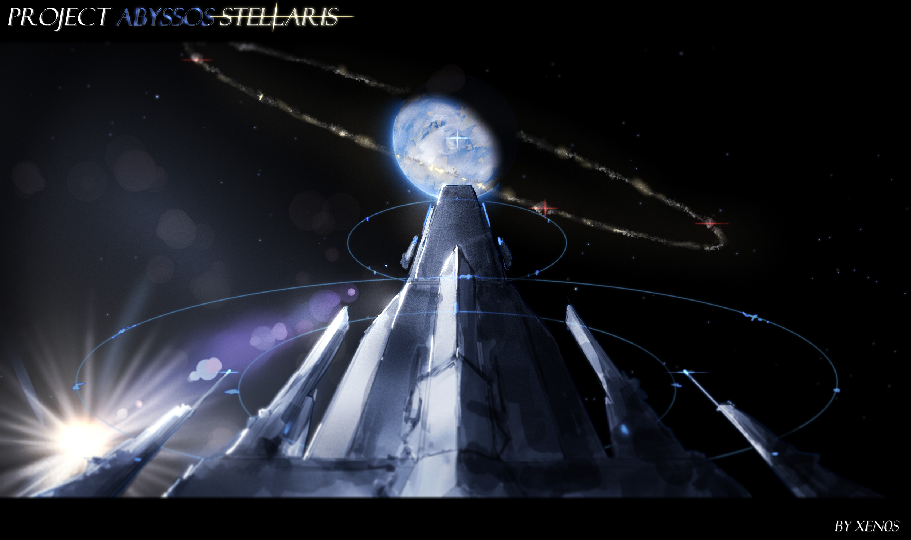
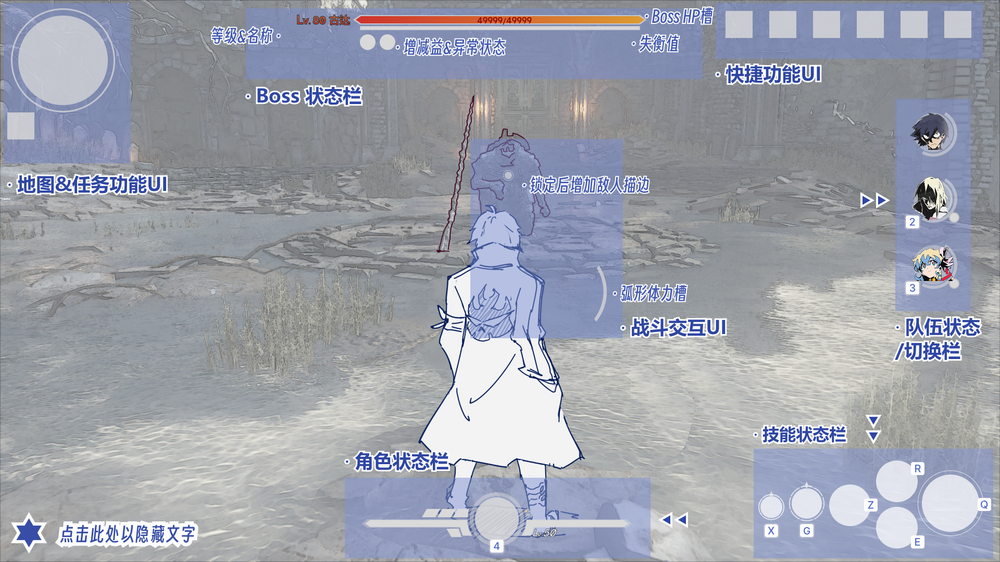
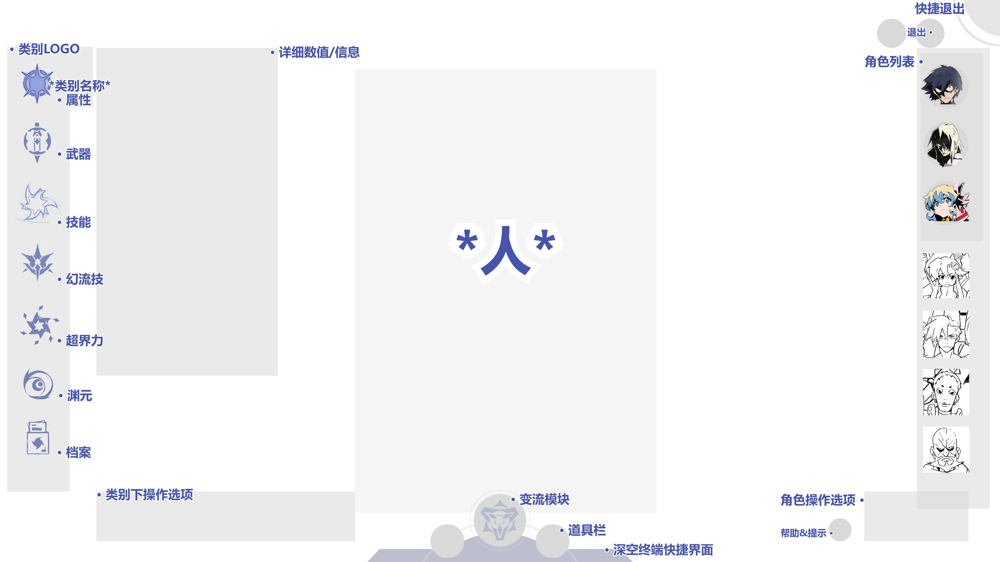
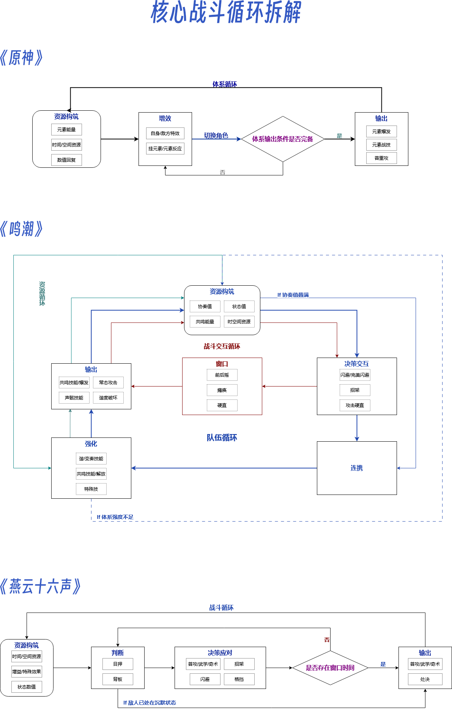

# Game Designer Portfolio

## About Me
世界观 / 战斗系统策划方向

关注：
- 世界观构建
- 动作游戏战斗体验
- 战斗循环与构筑设计

当前作品以：
- 世界观设计
- 战斗系统设计及其他相关系统
- 战斗循环拆解
为主。

---

## 《Project 星渊》[点击此处以下载作品文件合集（zip）](https://github.com/XEn0s-AS/XEn0s-AS.github.io/releases/download/2026-05-13-assets/Project.zip)

### 世界观 <a href="https://raw.githubusercontent.com/XEn0s-AS/XEn0s-AS.github.io/main/《Project%20星渊》%20GDD%20-%20世界观.pdf" target="_blank">点击此处以查看网页版文档(PDF)</a>
   - **世界本源**与**能量体系**
   - 国家、势力与主要角色
   - 系统耦合说明与基础**剧情骨架**  
  
  
### 战斗系统 <a href="https://raw.githubusercontent.com/XEn0s-AS/XEn0s-AS.github.io/main/《Project%20星渊》%20GDD%20-%20战斗系统.pdf" target="_blank">点击此处以查看网页版文档(PDF)</a>

   - 能量体系
   - 核心战斗循环图
   - 战斗框架、机制与结构
   - 设计规范与约束
   - 竞品分析（《原神》《燕云十六声》《鸣潮》）
   - 设计规范  
  
  
### 系统框架&链路图

   - 表示游戏各主要系统框架**间**如何联系及重要输入/输出**链路**  
  
  
### 战斗玩法 <a href="https://raw.githubusercontent.com/XEn0s-AS/XEn0s-AS.github.io/main/《Project%20星渊》%20GDD%20-%20战斗玩法.pdf" target="_blank">点击此处以查看网页版文档(PDF)</a>
   - 大世界、节点、副本、试炼、Roguelite等玩法的**形式**以及相关产出**资源**  

  
  
### 构筑系统 <a href="https://raw.githubusercontent.com/XEn0s-AS/XEn0s-AS.github.io/main/《Project%20星渊》%20GDD%20-%20构筑系统.pdf" target="_blank">点击此处以查看网页版文档(PDF)</a>
   - 角色与武器的**构筑**方式与维度、【渊元】的作用与重要性
   - 【变流模块】的作用方式与用途  
  
  
### UI设计与概念草图[点击此处以下载概念草图&UI文件（zip）](https://github.com/XEn0s-AS/XEn0s-AS.github.io/releases/download/2026-05-13-Pics/UI.zip)
   - 设计了战斗界面与培养/构筑界面UI的原型（**点击下图以跳转Figma链接**）
   - 大陆板块的排布与**国家**、国家剧情**主题**
   - 月球基地分层设计
   - 开始/登陆界面示意图  
 

---
  
## 拆解与OC  
### 《原神》《鸣潮》《燕云十六声》战斗循环拆解  
  

  
  
## Contact
vx：KJHZXC_07
Email：wobushiyaoshuhan@126.com
Thanks for reading
